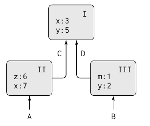
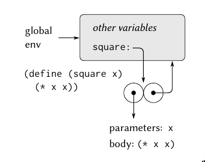
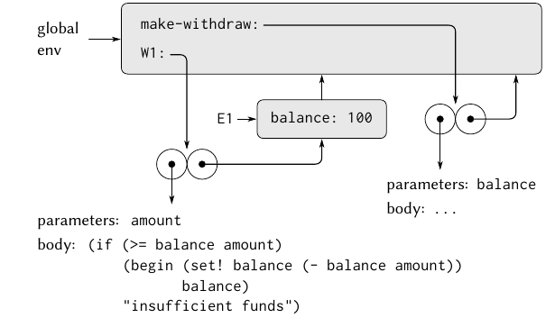

Read Section 3.1, 3.2

Read [Object Oriented Programming | Below the line view](https://inst.eecs.berkeley.edu//~cs61a/reader/belowline.pdf)

Encompasses Lecture 21, 22, 23

Modularity - can be divided "naturally" into coherent parts that can be separately developed and maintained.

Organizational Strategies:

- Objects - views a large system as a collection of distinct objects whose behaviours may change over time. Have to be concerned with how objects can change but still maintain its identity.
- Streams - information flows by applying operations onto data. Can be exploited to apply operations lazily (delayed evaluation)

### Assignment and Local State

In a system composed of many objects, the objects are rarely completely independent. "A system composed of separate objects is most useful when state variables of the system can be grouped into closely coupled systems that are only loosely coupled to other subsystems". That allows the entire system to be modular, and allows parts of the system to be tested and debugged separately, making maintenance easier.

In scheme, you can create local variables using the `let` keyword, so this would sort of create a 'bank account' (object, in an OOP sense), by using local scope and `set!`

```
(define new-withdraw
(let ((balance 100))
  (lambda (amount)
    (if (>= balance amount)
      (begin (set! balance (- balance amount))
        balance)
      "Insufficient funds"))))
```

`new-withdraw` returns a `lambda`, whose `set!` refers to the locally defined `balance`.

Similarly, you could create a `make-account` procedure which returns a `dispatch` method, and use `'withdraw` or `'deposit` to `set!` the local `balance` variable.

Introducing state/local variables causes lots of confusion and problems, but it also simplifies otherwise complicated code. Consider seeding a random number generator. If we can't save some initial seed value for a PRNG, every operation that needs a random number will have to have the result of the previous operation. This leads you to passing around an additional seed/PRNG value everywhere, else your methods are not purely functional. In haskell, this confusion is typed with a monad.

Introducing assignment means that you can no longer use the substitution model. It becomes harder to read code whose results can depend on multiple mutable global variables. "No simple model with 'nice' mathematical properties can be an adequate framework for dealing with objects and assignment in programming languages".

'A language that supports the concept that "equals can be substituted for equals" in an expression without changing the value of the expression is said to be _referentially transparent_'. Once you include `set!`, you've violated referential transparency. The meaning of 'same' becomes much harder to model.

Compare:

```
(define peter-acc (make-account 100))
(define paul-acc (make-account 100))
```

vs.

```
(define peter-acc (make-account 100))
(define paul-acc peter-acc)
```

This demonstrates the difference between comparing objects by value vs identity.

In general, so long as we never modify data objects, we can regard a compound data object to be precisely the totality of its pieces.

In imperative programming, since were not following the substitution model, the order of operations becomes much more important, and its possible to get incorrect answers by not considering how the order of operations affects local state of complex systems. This becomes even worse if operations execute in parallel, since its not always easy to determine which operations depend on each other.

### Environment Model of Evaluation

An environment is a sequence of _frames_. Each frame is a table (possibly empty) of bindings, which associate variable bindings with values. Each frame points to a higher enclosing environment (except the global frame).

The value of a variable refers to the closest frame which include a binding to the symbol. If no frames include a binding, its said to be _unbound_.



If in scope `II`, `x`'s value would be 7. The binding in `II` is said to _shadow_ the binding of `x` to `3` in `I`.

For simplicity, you can think of the global environment as the highest scope, which includes bindings like `+` or `*`, which represent built-in symbols.

#### Rules for evaluation

For a procedure like:

```
(define square
  (lambda (x) (* x x)))
```

... the `square` symbol is then defined globally. Calling a `lambda` body creates a frame, which then has a pointer to the environment it was defined in.



In general, `define` creates definitions by adding bindings to frames.

To apply a procedure to arguments, create a new environment containing a frame that binds the parameters to the values of the arguments. The enclosing environment of this frame is the environment specified by the procedure (the enclosing frame of where the procedure was defined).

The Environment Model can be summarized by two rules:

- A procedure object is applied to a set of arguments by constructing a frame, binding the formal parameters of the procedure to the arguments of the call, and then evaluating the body of the procedure in the context of the new environment constructed. The new frame has as its enclosing environment the environment part of the procedure object being applied.
- A procedure is created by evaluating a sexpr (lambda) relative to a given environment. The resulting procedure object is a pair consistent of the text of the sexpr and a pointer to the environment in which the procedure was created.

Very simply:

- Substitution Model: `(eval expr)`
- Environment Model: `(eval expr environ)`

In scheme, `define` lets you create bindings, and `set!` allow us to modify bindings. In the substitution model, there's often an implicit third `eviron` argument, which would be `theglobalenv` (the global frame)



Running `make-withdraw` multiple times would create separate environments, so the `balance` binding would use its own frame.


The `amount` is the formal parameter to the method, which is created each time the function is called. It points to the `E1` frame, which includes the `balance` binding, which points to the global frame.

The symbols/code that describe the `parameters` and `body` do not depend or change when the values in each account do, so they can be kept separately and shared across instances. Whether or not they actually are is an implementation detail, since it wouldn't change the result, it would be an optimization that reduces memory usage.


This method of symbol lookup is called lexical scoping. An alternative would be dynamic, where the lookup is determined by the most recent environment on the stack in a specific procedure call which has a formal parameter with the same symbol name. Dynamic scoping is much harder to optimize since lookups are done at runtime. Lexical scoping can allow you to do some optimizations, it allows you to know the offsets for binding lookups relative to the memory address of their environment at compile time.

Two key properties that make local procedure definitions a useful technique for modularizing programs:

- The names of local procedures do not interfere with names external to the enclosing procedure, because the local procedure names will be bound in the frame that the procedure creates when it is run, rather than being bound in the global environment.
- The local procedure can access the arguments of the enclosing procedure, simply by using the parameter names as free variables (variables not defined as a formal parameter to a procedure). This is because the body of the local procedure is evaluated in an environment that is subordinate to the environment for the enclosing procedure.

This often means that local procedure definitions which deal with state are easier to read and work how you expect them to, since they're pointing at the 'correct' frames.

We could say that the environments that are created when lambdas are run are closures. Could be said that all bindings are just closures in some global frame, whose values are stored as a binding in the 'global closure'. Which is true, but we often don't think of it that way since its not incredibly helpful.

### Message Passing

Any OOP system that uses the message-passing model must have some below-the-line mechanism for associating methods with messages. This is typically done by binding a symbol/name.

If we are treating objects as an ADT, programs that use objects shouldn't know that we happen to be representing objects as procedures. This can be fixed by wrapping the `dispatch` procedure:

```
(if (method? method)
  (apply method args)
  (error "No method" message (cadr method)))
```

### Inheritance and Delegation

It may make sense that all parent methods would just be copied into the child when a class is created, but it typically isn't done that way. Its done through _delegation_ - each object contains only the methods for its own class, and then a instance variable of the parent class. If the methods aren't found in the child class, it passes a message to the parent class, which then passes to its parent if it can't find the symbol.

Typically, the parent class instance variable is created when the class is defined, and would be shared across instances.

A downside of the delegation approach (at least in MIT-Scheme's basic implementation) is a parent class doesn't have access to local state defined in a child class.
