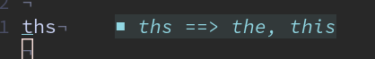

The [builtin spell checker](https://neovim.io/doc/user/spell.html) for [neovim](https://neovim.io/), like most 'check-tokens-against-a-dictionary' spellcheckers, is far too broad to be useful to have enabled all the time - it ends up distracting me more than it is useful.

I do sometimes use `:set spell`, and use `]s` and `[s` to jump between all the possibly misspelled words -- but especially when writing code, documentation, or even using URLs that include links to projects, it tends to report a lot of false positives.

As an example, looking at my [todo blog post](https://sean.fish/x/blog/managing-multiple-todo-txts/), it thinks `sean`, `todo`, `txt`, and `fzf` are are misspelled, because those aren't in its dictionary. You could expand the dictionary to support lots more words, but supporting thousands of acronyms means that you'll get false negatives as well.

I'd like to have something running to fix spellings for me, but not have it be that strict.

A decent middle ground for this problem is a tool that checks a file against commonly misspelled words, so that you can at least fix the couple dozen typos that you can't get out of your muscle memory.

There are lots of these, I used to use [`misspell`](https://github.com/client9/misspell) - but it hasn't been updated in 6 years, tried to use [typos](https://github.com/crate-ci/typos) - but configuring it for global use is a pain, so I have landed on [codespell](https://github.com/codespell-project/codespell) for the time being.

To set that up in `neovim`, one can use [`nvim-lint`](https://github.com/mfussenegger/nvim-lint) module, a basic setup with [`lazy`](https://github.com/folke/lazy.nvim) looks like:

```lua
return {
    "mfussenegger/nvim-lint",
    event = { "BufReadPre", "BufNewFile" },
    config = function()
        local lint = require("lint")

        vim.api.nvim_create_autocmd({ "BufEnter", "BufWritePost" }, {
            group = vim.api.nvim_create_augroup("RunLinter", { clear = true }),
            callback = function()
                lint.try_lint("codespell")
            end,
        })
    end,
}
```

That runs codespell against the current file, saving any misspellings to the built-in `vim.diagnostics` whenever I save the file, and looks like this:



If you have keybindings setup to jump between diagnostics, something like:

```lua
vim.keymap.set("n", "]w", function() vim.diagnostic.jump({ count = 1 }) end)
vim.keymap.set("n", "[w", function() vim.diagnostic.jump({ count = -1 }) end)
```

...then you can use those to jump between misspelled words (along with any other warnings).

However, what if `ths` was actually a word you wanted to ignore? (In code, you can use `# codespell:ignore` to force it to ignore a single line, but that does not scale well)

Both vim and neovim do have a way for you to maintain a list of good/wrong words. For more info you can take a look at the [spell](https://neovim.io/doc/user/spell.html) docs, but basically, you can use `zg` to mark a word as **g**ood, `zw` to mark it as **w**rong. That adds words to your `spellfile`, one per line.

As it would happen, `codespell` has a CLI flag `--ignore-words=FILE` that lets you pass it a file with words to ignore, so the basic plan is to:

- Set an environment variable that lets me point the builtin nvim `spellfile` and `--ignore-words` at the same file
- Create a wrapper script that checks for that environment variable and calls `codespell`
- Update the `nvim-lint` configuration to point at the wrapper script

In my shell profile, I set:

```bash
export NVIM_SPELLFILE=~/Documents/.nvim_spelldir/en.utf-8.add
```

...mostly so my wordlist gets saved somewhere I remember, and I don't lose it when I eventually switch computers.

_(remember to `mkdir ~/Documents/.nvim_spelldir` so that doesn't fail to write)_

Create a wrapper script, `codespell-conf`, that uses that as an ignorelist, passing any additional arguments onto `codespell`:

```bash
#!/bin/sh
exec codespell --ignore-words="$NVIM_SPELLFILE" "$@"
```

Update my `init.lua` to use the environment variable `NVIM_SPELLFILE` as the location for its `spellfile`, and add a custom command so I can quickly edit it if I want:

```lua
-- save spellfile to my Documents
local os = require("os")
local spellfile = os.getenv("NVIM_SPELLFILE")
if spellfile then
    vim.opt.spellfile = spellfile
    -- running :Spellfile edits the file in nvim
    vim.api.nvim_create_user_command("Spellfile", function()
        vim.cmd.edit(spellfile)
    end, {
        desc = "open the spellfile for me to edit",
    })
end
```

Update the `nvim-lint` configuration so it uses the custom command:

```lua
return {
    "mfussenegger/nvim-lint",
    event = { "BufReadPre", "BufNewFile" },
    config = function()
        -- set the 'cmd' field
        require("lint.linters.codespell").cmd = "codespell-conf"

        local lint = require("lint")

        -- updates the diagnostics when you open, and after you save the file
        vim.api.nvim_create_autocmd({ "BufEnter", "BufWritePost" }, {
            group = vim.api.nvim_create_augroup("RunLinter", { clear = true }),
            callback = function()
                lint.try_lint("codespell")
            end,
        })
    end,
}
```

And that's it! If you then hover a word that `codespell` thinks is misspelled and press `zg`, it gets added to the internal nvim wordlist, and (after a `BufWritePost` (writing the file)) gets ignored by `codespell`.
