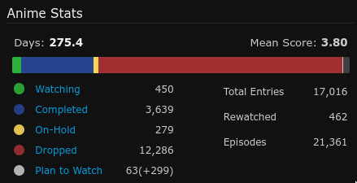
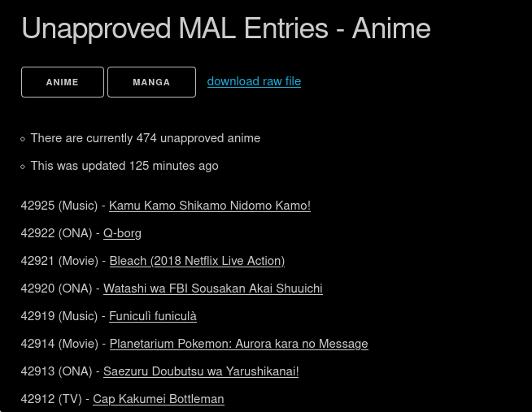

For general thoughts on online databases, see [online databases](../../online_databases/)

### MAL?

Though there's downtime, the site/API was down for months and due to the owners changing, always feels like third party developers aren't a priority, [MyAnimeList](https://myanimelist.net) (MAL) has the most history, experienced users and entries (most entries is a big factor for me). Some of the more recent sites (e.g. [AniList](https://anilist.co/)) started off by taking MALs data, often mapping IDs one-to-one. Having lots of users also means sources for obscure entries might be listed in the forums for each entry.

From about 2015-2018, I spent quite a lot of time watching anime. Less recently, because I've somewhat exhausted all the things I'm interested in. I used [`MAL`](https://myanimelist.net) as a database of sorts. When I did this, it was pretty systematic:

- sort entries into short films, TV shows, lost media, things I'm interested in using tags
- watch some of each entry, to see if I like it. On MAL, I use categories like:
  - `watching`: things I haven't tried yet
  - `completed`: things I've watched/finished
  - `on-hold`: things I've watched some of/am interested in continuing
  - `dropped`: things I've dropped, or sequels of things I've dropped (since I'm not interested in continuing those)
  - `plan to watch`: things that haven't aired yet

(So, at the time of writing this, there's 12286 entries that I've tried and dropped, or otherwise categorized into 'not interested in')

There was a point in early 2017 where I had watched every music video/short film on MAL, and there wasn't what I considered to be a comprehensive list, so I ended up creating [a list of my favorites](https://sean.fish/animeshorts/).

Ended up writing [lots of userscripts](https://greasyfork.org/en/scripts?set=22083) for MAL, because it isn't the best out of the box. ([Github Repo](http://github.com/seanbreckenridge/greasyfork))

In the past, I used the newly added entry feed to discover new interesting short films/music videos to watch, as entries were added to the database I would watch everything. Most things were bad, but sometimes I would find something great, and I enjoyed being able to share that with people.

The approval process for MAL entries isn't transparent, and as someone who has most of the entries on their list, looking if any new ones have been approved, it can be annoying to manually look at recently approved entries every day. So, I have a [webscraper](https://github.com/Hiyori-API/checker_mal) that runs on my server to check if new entries have been approved, which updates a couple json files, a [website](https://github.com/seanbreckenridge/mal-unapproved) to list unapproved entries, a [discord bot](https://github.com/seanbreckenridge/mal-notify-bot) to notify me whenever new ones are added, as well as [archiving any deleted/denied](https://sean.fish/dbsentinel/) entries.

At this point my involvement with MAL/anime is mostly maintaining these projects for the other couple dozen users who find all this interesting, and watching a couple shows an keeping up with my favorite indie animators.

### Other sites?

MALs API was dead for a while, so for a while I used [Jikan](https://github.com/jikan-me/jikan-rest/) instead, which scrapes the website.

Currently, its quite frustrating to maintain projects that depend on Jikan/MAL, MALs recently been blocking scrapers since their official API has been released (though its not well documented, and I'm not a fan of how they handled OAuth). I'm quite entrenched in the MAL community, but I may switch to AniList at some point, in addition to maintaining a local cache of my MAL list using Hiyori.

Edit: even now, using the official API, there are lots of random errors, sometimes reads just silently fail and it returns bogus data...

Even still, If one is submitting new entries to one of the databases, though the site isn't the best, you're better off submitting entries to MAL, because the other sites _know_ that MAL has the most entries and they all copy data/source entries from it. You improve most of sites by submitting to MAL, while it can sometimes feel like you're wasting time submitting entries to other sites that might not have as much reach.

[AniList](https://anilist.co/) looks much nicer from a developers point of view, being Graphql, with owners/leads who communicate much more frequently. However, there are concerns with managing a large list with their API; there's a limit to how many can be shown on their web interface, and I [can't really import my list](https://anilist.co/forum/thread/33798)

[Kitsu](https://kitsu.io) is another option but its just not as complete/also suffers from occasional downtime

The [AniDB Title Dump](https://wiki.anidb.net/API#Anime_Titles) may be useful for particular projects.

May be worth to move to AniDB or AnimePlanet, but those have smaller communities and Im not as active as I used to be
