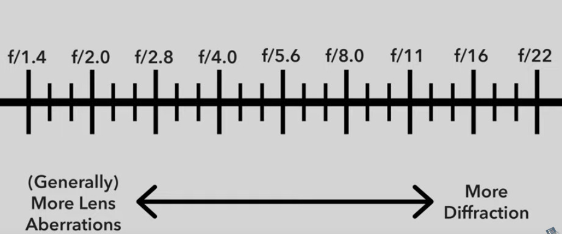

### Aperture

<https://www.youtube.com/watch?v=Npmt7_mlEeg>

aperture/f-stop: amount of light let into the lens. A smaller number on the fraction (e.g. f/1.4, f/2) means the lens is mostly open, larger number f-stops (f/5.6, f/8, f/16) means there's a smaller opening.

- f/4 is a large aperture
- f/16 is a small aperture

A larger aperture means that if you're capturing something in the foreground, the background may be out of focus. A narrower aperture (larger f-stop, like f/16) can make items more sharper.

smaller impacts:

- imperfections/dust specs are amplified when you have a narrow aperture (larger f-stop, like f/16)
- lower f-stop (e.g. f/1.8) can be less sharp near the edges
- very high f-stop can lead to [diffraction](https://en.wikipedia.org/wiki/Diffraction)
- aberrations:
  - [vignetting](https://en.wikipedia.org/wiki/Vignetting)
  - [como](<https://en.wikipedia.org/wiki/Coma_(optics)>) (lights turn into streaks near edges)

If there's nothing in the foreground, you can often get good sharpness on landscape shots by using a medium aperture, without risking aberrations.

These smaller impacts are not likely to ruin a photo, so if you need a small/large aperture for something, then use that.

### Shutter Speed

<https://www.youtube.com/watch?v=FdJhkRFFvUs>

Length of time your camera sensor is exposed to the outside world.

Fast shutter speed means a short exposure to light, slow shutter speed means its exposed to light for longer (is brighter)

if there is movement, a short shutter speed captures without blur, longer shutter speeds act as a sort of average of all of the light that hits the camera, so it may introduce blur.

things to think about:

- subject movement
- camera stability - if you're not using a tripod, slower shutter speeds mean your handheld shot might be blurry. could be mitigated by camera stabilization but that is post processing by lens/camera
- how zoomed in are you/how cropped is the image - when magnifying, you also magnify blur, so you need a faster shutter speed
- how close are you to subject - smaller movements are magnified when close, if using faster shutter speeds

For handholding, you probably need 1/30 or 1/50th of a second speeds to avoid motion blur due to background impact of shaky hands.

### ISO

to be reductive, is the sensistivity of the light sensor. higher values mean sensor does not need as much light, lower values means it needs to gather more light.

there are many ways to achieve what kind of exposure you want. If you reduce shutter speed, you may have to increase aperture or ISO. Or, if you increase ISO, you may have to decrease aperture or shutter speed (or some of both).

higher ISO leads to brighter images, so it can be useful in dark/night-time situations, but at high values can also lead to potential noise and grain (this can also be done on purpose, for creativity)

---

<https://www.youtube.com/watch?v=D-GfbRkFtuw&list=PL2M0W9hN1Zzyy5yFv3vqNi1_5LAk0bo2h&index=3>

strategy:

1. set base ISO (usually 100)
1. figure out what aperture you want for correct depth of field
1. select shutter speed that gives you the exposure
1. [maybe] use a faster shutter speed to eliminate motion blur
1. [maybe] increase brightness by bumping ISO (at high levels can lead to grain) or having a larger aperture (can affect depth of field)

---

- ambient light - how bright the outside world is
