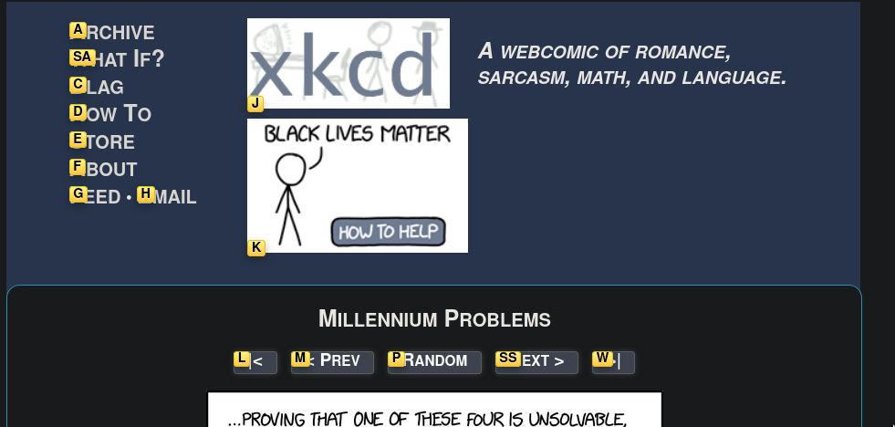

This is an extension of my [dotfiles](https://github.com/seanbreckenridge/dotfiles)

This is an ever evolving list of tools I use and recommend, or combinations of tools I use to optimize my workflow. Some of these might be obvious to you, but it might not be to everyone!

- Shells
  - [zsh](http://zsh.sourceforge.net/) - for the [`fish`](https://fishshell.com/)-like highlighting and auto completion, while still being *somewhat* posix compliant. Manually configuring everything makes this much faster than the monstrous `oh-my-zsh`.
  - bash/[dash](https://wiki.archlinux.org/index.php/Dash) - for shell scripting. My `zsh` setup is also much more dependent on external plugins, so I don't use that on servers, I just stick to bash there. My [bootstrap](https://github.com/seanbreckenridge/bootstrap/) script sets up new bash servers for me nicely, see [this post](/post/server_setup) for more info.
- Terminal
  - [alacritty](https://github.com/alacritty/alacritty), with pretty basic defaults
- OS-stuff
  - Linux Distrobution (though I'm forced to use Mac for work sometimes)
    - [Arch](https://wiki.archlinux.org/index.php/)
  - Window Managers
    - `qtile` - One could probably argue me into using another tiling window manager, but I'm super comfortable in python, and being able to configure and hack on it is easy for me.
    - `i3-gaps` - at this point, i3-gaps is just a fallback in case I mess up modifying `qtile` in-place and have to boot into a GUI to fix it.
  - [i3lock](https://i3wm.org/i3lock/) for screen lock; [daemon process](https://sean.fish/d/lock-screen?dark) caches pixelated version of screen to speed up start time. [Corresponding service file](https://sean.fish/d/lockscreen@.service?dark) to lock my screen whenever my laptop suspends.
  - [rofi](https://github.com/davatorium/rofi) for launching applications and switching windows
  - [dunst](https://dunst-project.org/) for notifications, pretty normal configuration
  - [lightdm](https://wiki.archlinux.org/index.php/LightDM) - display manager, some basic configuration using [lightdm-gtk-greeter-settings](https://www.archlinux.org/packages/community/any/lightdm-gtk-greeter-settings/)
- Editors
  - (doom) emacs
  - nvim
- to-do list - [todotxt](http://todotxt.org/) for todos, with a [rofi interface](https://sean.fish/d/todo-prompt?dark) as GUI, and [TUI](https://gitlab.com/seanbreckenridge/full_todotxt) for adding todos. The TUI I wrote forces me to specify a `deadline` for each todo, which I then get notified by [this](https://github.com/seanbreckenridge/todotxt_deadline_notify), which runs on my server.
- [ranger](https://github.com/ranger/ranger) - file manager
- [yadm](https://yadm.io) to manage dotfiles, see [yadm-with-README.md](https://sean.fish/d/yadm-with-README.md?dark). Once I have a terminal running, my [bootstrap](https://sean.fish/d/bootstrap?dark) script sets up my system entirely.
- Browsers
  - [firefox-developer-edition](https://www.mozilla.org/en-US/firefox/developer/), with extensions:
    - Productivity
      - [vimium-ff](https://addons.mozilla.org/en-US/firefox/addon/vimium-ff/). Learning vimium has virtually killed the mouse for me. Especially the `f` binding (see the image below). I now sit feet away from my laptop with mechanical keyboard in hand, reaching over only for horrible sites which don't comply to the HTML standard (looking at you, clicking the `next episode` button on `Netflix`)
      - [RES](https://addons.mozilla.org/en-US/firefox/addon/reddit-enhancement-suite/), to make reddit manageable, though I don't go to reddit much these days.
      - [Violentmonkey](https://addons.mozilla.org/en-US/firefox/addon/violentmonkey/) so I can add bits of JS to sites I want to fix.
      - [Refined Github](https://addons.mozilla.org/en-US/firefox/addon/refined-github-/) for general Github improvements.
      - [Stylus](https://addons.mozilla.org/en-US/firefox/addon/styl-us/), so I can dark mode common websites.
      - [Dark Reader](https://addons.mozilla.org/en-US/firefox/addon/darkreader), so I can dark mode every website I visit. Does have considerable overhead, so I prefer finding CSS through stylus for websites I visit often.
    - Privacy
      - [uBlock Origin](https://addons.mozilla.org/en-US/firefox/addon/ublock-origin/) to block ads.
      - [DuckDuckGo Privacy Essentials](https://addons.mozilla.org/en-US/firefox/addon/duckduckgo-for-firefox/)
  - I use [`lynx`](https://www.lynxproject.org/) to do quick `duckduckgo` searches without leaving the terminal (TODO: write a post showing how to do this)
  - I'm somewhat required to test websites in chrome, so I use `chromium` to do that.

TODO: look at my shortcuts/bin dirs and grab tools to mention

